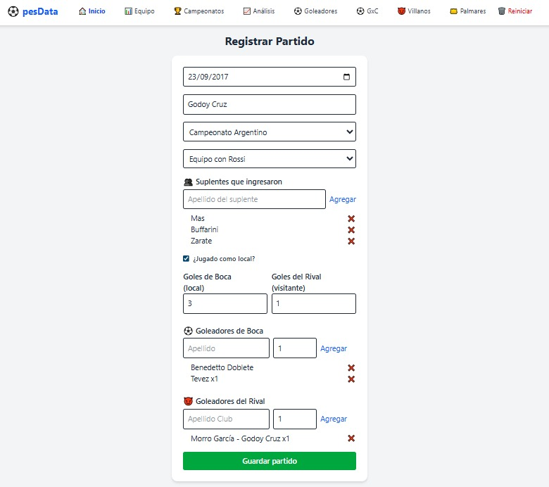
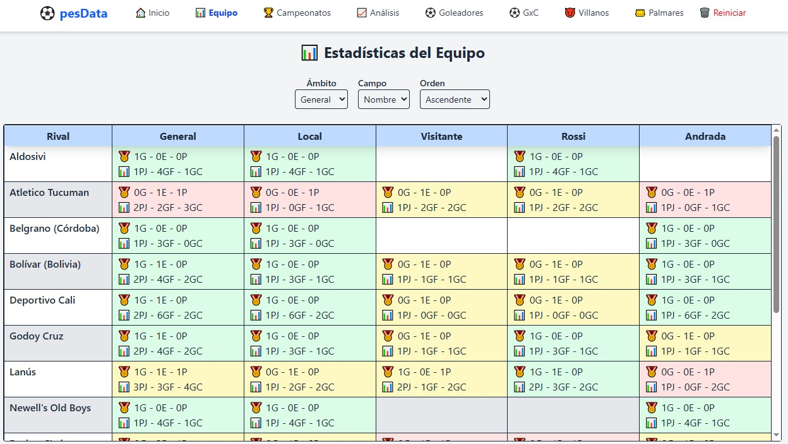
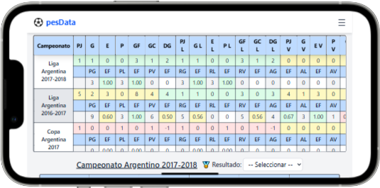
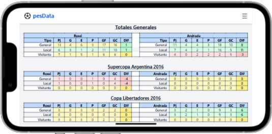
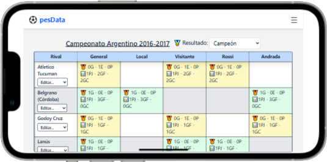
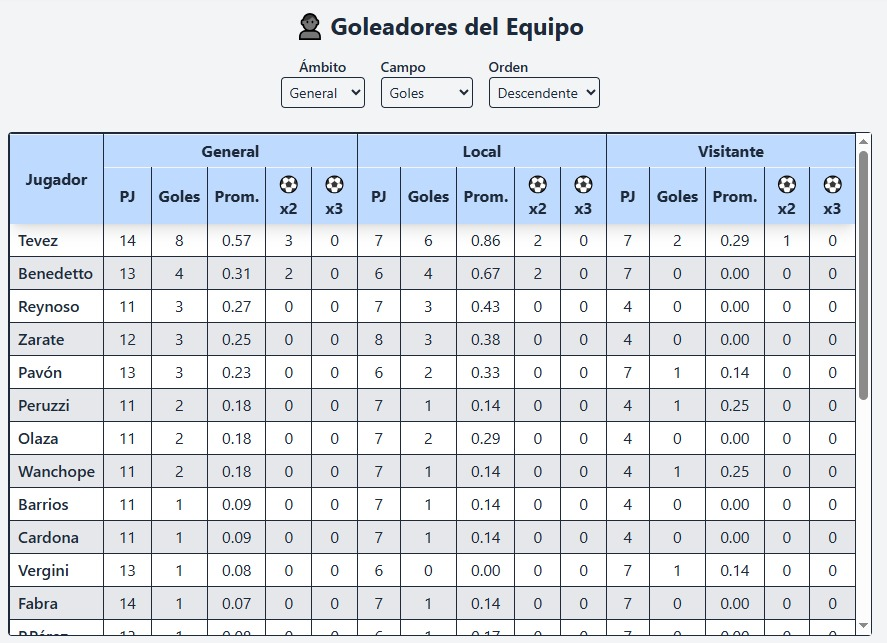
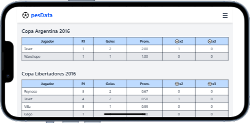
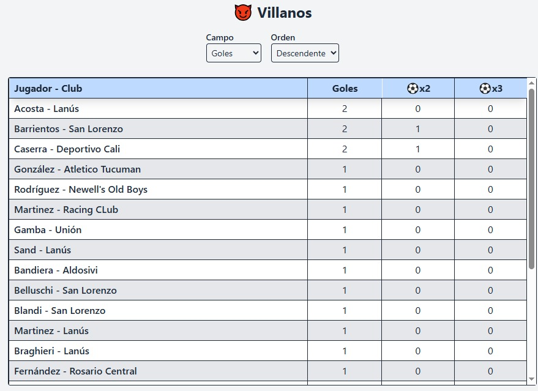
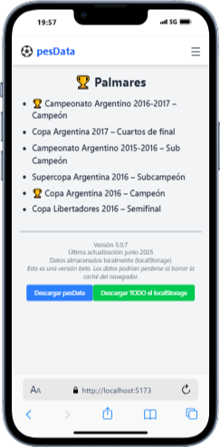

# 🏟️ PES Data

Una aplicación personalizada para llevar **estadísticas completas y visualmente atractivas** de tus partidos en **PES 2019**, centrada en tu experiencia con **Boca Juniors** en la Liga Argentina y copas internacionales.

---

## 🎯 Propósito

Esta app fue desarrollada de manera 100% personalizada con un solo objetivo:

> **Llevar un registro detallado de todas tus estadísticas en PES 2019, conocer tu rendimiento con tus dos equipos principales y tener un historial visual que te ayude a mejorar partido a partido.**

Es un proyecto de uso **exclusivamente personal**, creado por diversión y como ejercicio de programación.

---

## ⚽ Características principales

✔ **Carga completa de partidos:**

- Fecha y rival.
- Campeonato disputado (Liga Argentina, Copa Argentina, Copa Libertadores, Supercopa Argentina, Mundial de Clubes).
- Local o visitante.
- Resultado del partido.
- Goleadores de Boca y del rival.
- Equipo utilizado (dos planteles diferentes para manejar la fatiga acumulada).
- Suplentes que ingresaron.

---

✔ **Sugerencias inteligentes:**

- Lista de jugadores propios predeterminada.
- Rivales y goleadores rivales se guardan y sugieren automáticamente en futuras temporadas.

---

✔ **Historial y estadísticas:**

- **Equipo:** historial contra cada rival, mostrando partidos jugados, ganados, empatados, perdidos, goles a favor y en contra. Todo separado por local, visitante y equipo usado. Las celdas se colorean (verde/amarillo/rojo) según el balance.
- **Campeonatos:** tabla general de desempeño por torneo y enfrentamientos específicos con rivales.
- **Análisis:** comparación de tus dos equipos principales.
- **Goleadores:** tabla global de tus goleadores.
- **Goleadores por campeonato:** desglosados por cada torneo.
- **Villanos:** goleadores rivales que te marcaron.
- **Palmarés:** resultados finales de cada campeonato.

---

✔ **Visualización ordenada:**

- Ordenamiento ascendente y descendente de todas las estadísticas.
- Tablas optimizadas para celulares (modo apaisado recomendado en algunas vistas).

---

✔ **Respaldo y reinicio:**

- Botón para descargar el JSON con todos los datos.
- Botón para reiniciar toda la información borrando el `localStorage`.

---

## 📷 Capturas

### 📊 Formulario


---
### 📊 Estadísticas generales


---

### 🏆 Campeonatos


---
### 🏆 Análisis de los equipos


---

### ⚔️ Historial vs rivales


---

### ⚽ Goleadores


---
### ⚽ Goleadores por campeonatos


---

### 💀 Villanos (goleadores rivales)


---

### 🏅 Palmarés



---

## 🚀 Instalación

Cloná el repositorio:

```bash
git clone <https://github.com/Mati69lbt/Pes_Data>
``` 

Instalá las dependencias:
```bash
npm install
``` 

Iniciá el proyecto en modo desarrollo:
```bash
npm run dev
``` 

## 🧑‍💻 Tecnologías utilizadas

- React
- TailwindCSS
- React Router
- React Toastify
- Vite

---

## 📱 Compatibilidad

✅ Optimizada principalmente para **celulares**.  
✅ Algunas tablas anchas pueden requerir **modo apaisado**.  
✅ Compatible con escritorio y otros dispositivos.

---

## ⚙️ Almacenamiento de datos

Toda la información se guarda en **localStorage**, por lo que:

- No requiere servidor ni base de datos.
- Los datos persisten mientras no los borres.
- Podés exportar el JSON de respaldo en cualquier momento.

---

## 🌟 Lo que hace especial a esta app

Lo más importante de PES Data es su **nivel de detalle y personalización**:

- Podés ver visualmente tu evolución.
- Identificar rápidamente fortalezas y debilidades.
- Usar los colores de las tablas como referencia clara de desempeño.
- Llevar un registro histórico de todas tus temporadas.

---

## 💡 Futuro

Actualmente no hay planes de:

- Incorporar otras ligas.
- Exportar en CSV/PDF.
- Migrar a base de datos.

Es una herramienta creada **a medida**, pensada para un uso personal continuo.

---

## 📄 Licencia

Uso personal. No destinada a distribución ni uso comercial.
